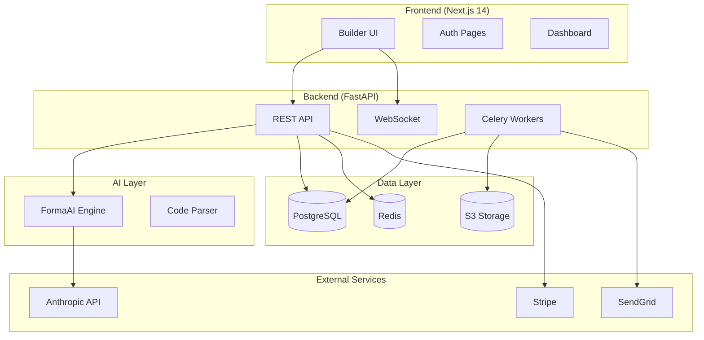
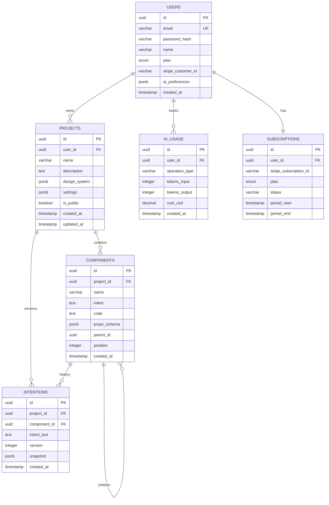
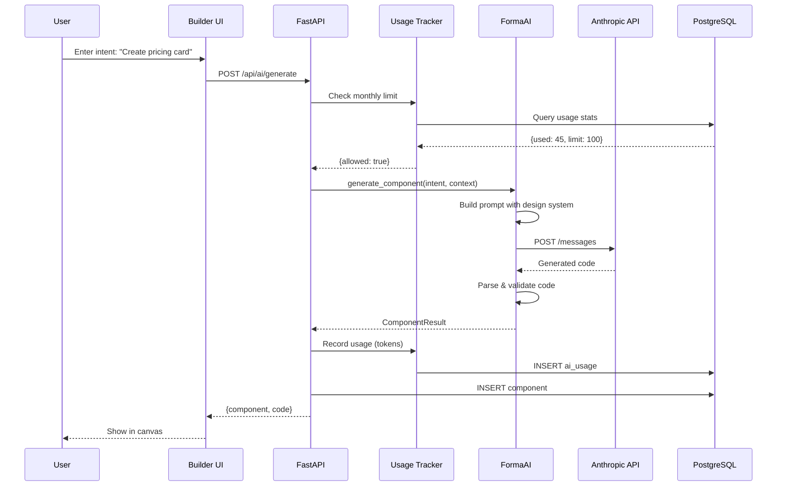
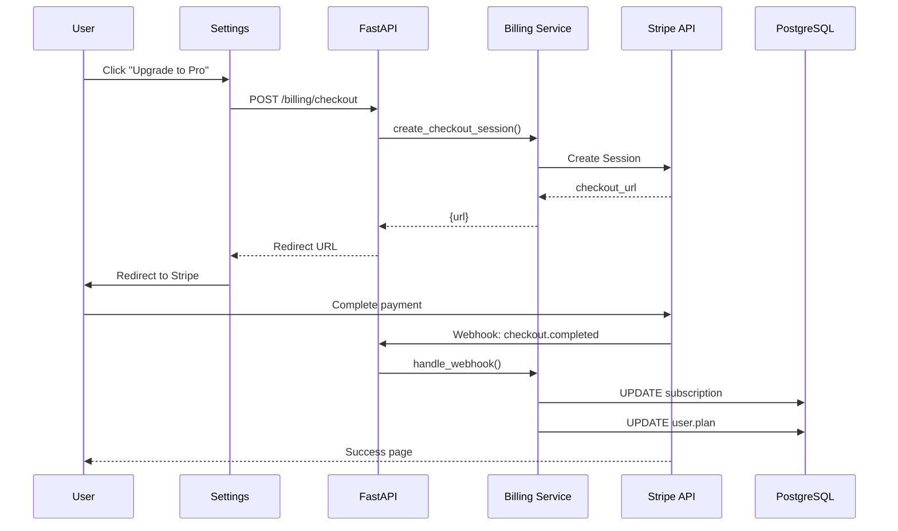
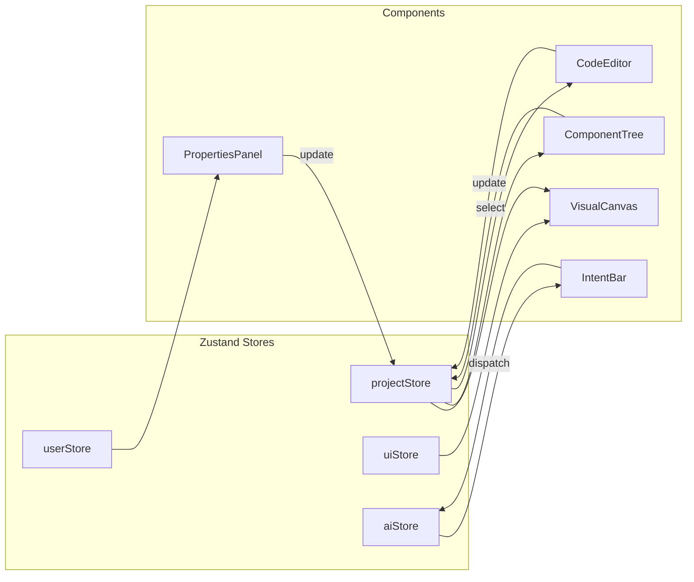
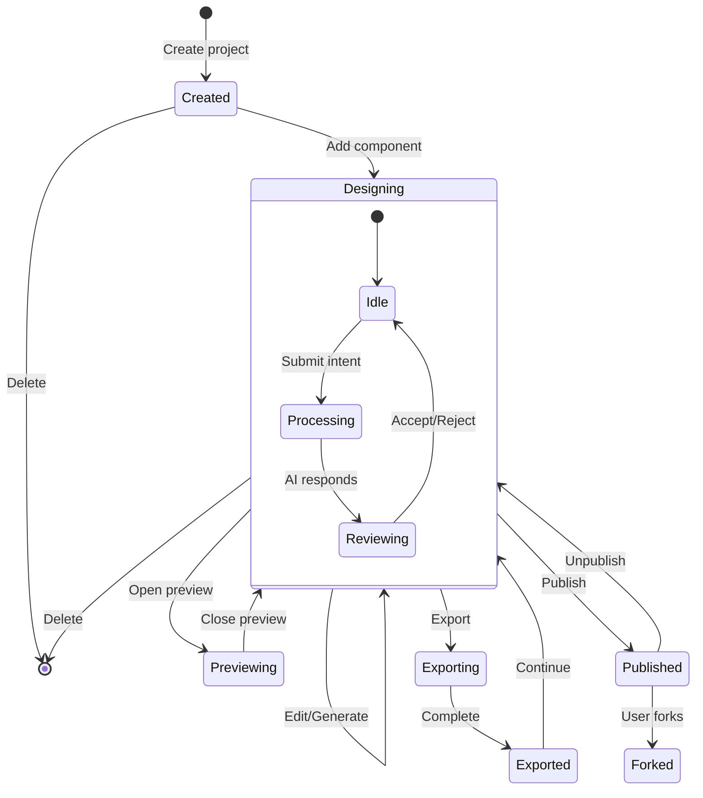
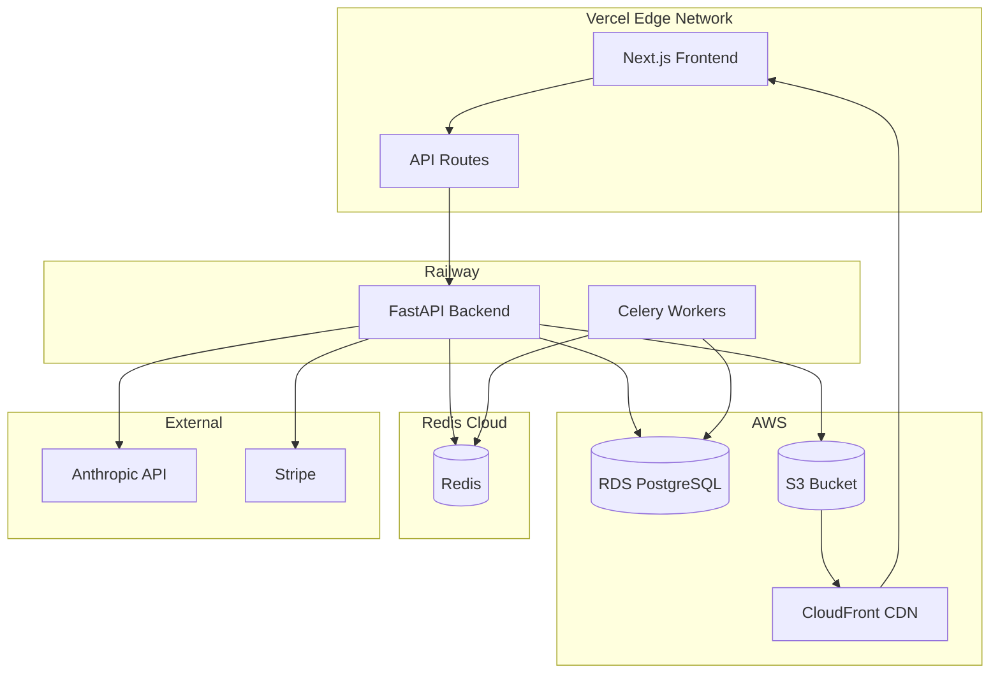

# FORMA Architecture Documentation

## System Overview

FORMA is a white-label AI-powered React component builder. Users describe components in natural language, and the system generates production-ready React code.

---

## High-Level Architecture

---

## Database Schema (ERD)

---

## Component Generation Flow

---

## Billing Flow

---

## State Management

---

## Project State Machine

---

## API Endpoints

### Authentication
| Method | Endpoint | Description |
|--------|----------|-------------|
| POST | `/api/auth/register` | Create account |
| POST | `/api/auth/login` | Login, get tokens |
| POST | `/api/auth/logout` | Invalidate tokens |
| POST | `/api/auth/refresh` | Refresh access token |
| GET | `/api/auth/me` | Get current user |

### Projects
| Method | Endpoint | Description |
|--------|----------|-------------|
| GET | `/api/projects` | List user projects |
| POST | `/api/projects` | Create project |
| GET | `/api/projects/{id}` | Get project details |
| PUT | `/api/projects/{id}` | Update project |
| DELETE | `/api/projects/{id}` | Delete project |
| GET | `/api/projects/{id}/export/nextjs` | Export as Next.js |
| GET | `/api/projects/{id}/export/vite` | Export as Vite |

### Components
| Method | Endpoint | Description |
|--------|----------|-------------|
| GET | `/api/projects/{id}/components` | List components |
| POST | `/api/projects/{id}/components` | Create component |
| PUT | `/api/projects/{id}/components/{cid}` | Update component |
| DELETE | `/api/projects/{id}/components/{cid}` | Delete component |
| GET | `/api/projects/{id}/components/{cid}/intentions` | Get version history |
| POST | `/api/projects/{id}/components/{cid}/rollback` | Rollback to version |

### AI Operations
| Method | Endpoint | Description |
|--------|----------|-------------|
| POST | `/api/ai/generate` | Generate component from intent |
| POST | `/api/ai/edit` | Edit component with intent |
| POST | `/api/ai/explain` | Explain code |
| POST | `/api/ai/refactor` | Suggest refactoring |
| POST | `/api/ai/debug` | Debug component |
| GET | `/api/ai/usage` | Get usage stats |

### Billing
| Method | Endpoint | Description |
|--------|----------|-------------|
| GET | `/api/billing/subscription` | Get subscription info |
| POST | `/api/billing/checkout` | Create checkout session |
| POST | `/api/billing/portal` | Create customer portal |
| POST | `/api/billing/webhook` | Stripe webhooks |

---

## Deployment Architecture

---

## Pricing Tiers

| Feature | Starter ($29/mo) | Pro ($79/mo) | Team ($199/mo) |
|---------|------------------|--------------|----------------|
| AI Operations | 100/mo | 500/mo | 2,000/mo |
| Projects | 3 | Unlimited | Unlimited |
| Export Code | ✓ | ✓ | ✓ |
| Custom Domain | - | ✓ | ✓ |
| Design System | Basic | Full | Full |
| Collaboration | - | - | ✓ |
| SSO/SAML | - | - | ✓ |
| API Access | - | - | ✓ |
| Priority Support | - | ✓ | ✓ |

**Overage Rate:** $0.05 per AI operation after limit

---

## Tech Stack Summary

| Layer | Technology |
|-------|------------|
| Frontend | Next.js 14, React 19, TailwindCSS |
| State | Zustand |
| UI Components | Radix UI, Framer Motion |
| Code Editor | Monaco Editor |
| Visual Builder | React Flow |
| Backend | FastAPI, Python 3.11+ |
| Database | PostgreSQL 15 |
| Cache | Redis |
| Task Queue | Celery |
| AI | Anthropic Claude API |
| Payments | Stripe |
| Storage | AWS S3 |
| CDN | CloudFront |
| Hosting | Vercel (Frontend), Railway (Backend) |
